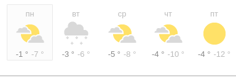
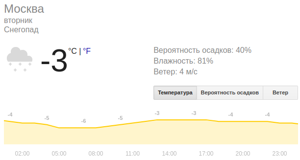

# Прогноз погоды на React

Сделайте одностраничное приложение при помощи React. На странице должен быть прогноз погоды на 5 дней. Прогноз вы можете взять из любого стороннего API. Например: [OpenWeatherMap](https://openweathermap.org/api). Вам будет необходимо зарегистрироваться, чтобы получить бесплатный доступ к API. Однако это будет необходимо только ближе к релизу 3.

На каждом элементе, отвечающем за день, должны отображаться температура (самая низкая, самая высокая) и картинка, соответствующая солнечному, дождливому, облачному, снежному дню.

*Рисунок 1. Краткий прогноз на 5 дней.*

### Release 0. Основа
Для начала добейтесь, чтобы у вас все правильно отображалось без запросов к API.
То есть напишите нужные компоненты. Прогноз погоды - вероятно компонент, как и отдельно взятый день.
Добавьте все необходимые свойства(props). Добавьте метод, который передает данные о погоде во все дни. В данном релизе можете использовать фальшивые данные, то есть не получать их через API, а сгенерировать самостоятельно.

### Release 1. Детальное отображение
Теперь добавьте под имеющимся кратким прогнозом еще одну компоненту. В ней будет отображаться более подробный прогноз погоды на конкретный день(например по часам). На какой именно день? На тот, на который кликает пользователь. Для начала можете отображать в новом блоке те же данные, что и в том дне, на который нажал пользователь, то есть без более детальной информации. В дальнейшем рекомендуется ее добавить.

*Рисунок 2. Детальный прогноз на конкретный день.*
 
### Release 2. Фичи
*Можете сделать один из релизов 2a, 2b, 2c. Если успеваете - сделайте 2 или все 3 из них.*

#### Release 2a 
Добавьте поле, в которое пользователь будет вводить название города, в котором он хочет посмотреть погоду. Рядом с полем должна быть кнопка, по нажатии на которую будет обновляться информация в элементах, отвечающих за дни.

#### Release 2b
Добавьте кнопку со стрелкой `->` справа от дней. По нажатии на эту кнопку должны отобразиться следующие 5 дней *вместо* тех, что отображаются сейчас. То есть при помощи этой кнопки пользователь сможет пролистывать дни. Также можете добавить кнопку `<-`, которая будет пролистывать в обратную сторону. 

#### Release 2c
Добавьте селект, в котором можно выбирать количество дней, по которым пользователь хочет посмотреть погоду. По умолчанию оно 5. Но возможно пользователь хочет видеть погоду сразу же на 7 дней, 2 недели, месяц.

### Release 3. API + MongoDB
Настало время интегрировать базу данных и работу с API.
Подключите MongoDB. Создайте модель, соответствующую погоде на день. Используйте настоящие данные, которые надо получать при помощи API. При загрузке вашего приложения в браузере данные о погоде на ближайшие 5 дней должны подгружаться из БД, если они там есть. Иначе необходимо делать запрос к API, сохранять полученные данные в БД, а затем отображать их на странице.

### Release 4 (optional)
Если хотите усовершенствовать внешний вид, можете добавить графики(погоды на день/неделю), используя [chart.js](https://www.chartjs.org/), а также можете использовать уже знакомый вам Bootstrap.
